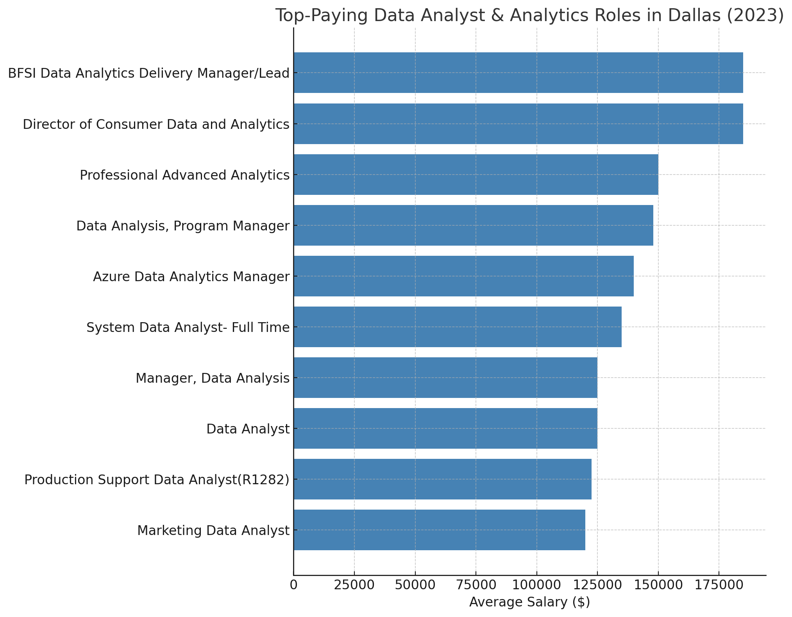
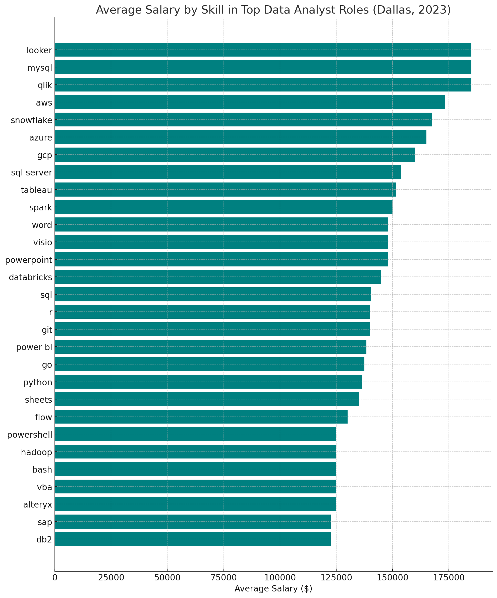
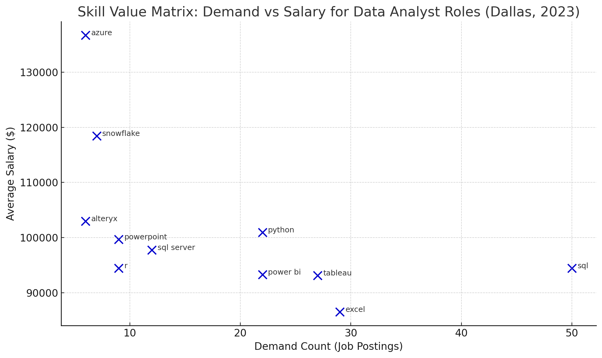

# Introduction
Cracking the Code of the Data Job Market: We dove into a data set of data analyst and similar roles to uncover where the money flows, which skills are high demand, and how the most sought-after skills are turning into six-figure paychecks in the analytics field in 2023.

SQL queries we used for digging: [sql_project folder](/sql_project/)

# Background
I wanted to make sure I was spending my time wisely—studying the right skills and aiming for the roles that truly matter. This project was my way of uncovering which data analyst skills are both in high demand and well-paid, helping me focus my efforts where they’ll have the biggest impact.

Data provided from the [SQL Course](https://www.lukebarousse.com/sql).
The data included insights on job titles, companies, locations, salaries, and essential skills associated with data jobs.

### The questions I wanted to answer through my SQL queries were:

1. What are the top paying Data Analyst jobs?
2. What skills are required for the top paying jobs?
3. What are the most in-demand skills for data analysts?
4. Which skills are associated with the higher salaried positions?
5. What are the most optimal skills to be adding to my skillset?

# Tools I Used
For this project I used several key tools to uncover the insights from the data provided:
- **SQL:**
Queried the job postings dataset to uncover high-demand, high-paying skills.
- **PostgreSQL:**
Managed and structured the job data within a relational database system.
- **Visual Studio Code:**
Served as my main environment for writing and executing SQL queries with integrated database tools.
-  **Git & GitHub:**
Enabled version control and collaboration. Tracked progress, shared code, and maintained a clean, reproducible workflow.

# The Analysis
## 1. What are the top paying Data Analyst jobs?
Focus was to find the highest paying jobs. Filtered the data analyst positions by average yearly salary and location (Dallas, TX). The query highlighted the highest paying opportunities. Pulling in data from a dimensional table to reveal the company names to align who was hiring for those positions.
```sql
SELECT
    job_id,
    job_title,
    job_location,
    job_schedule_type,
    salary_year_avg,
    job_posted_date,
    name AS company_name 
FROM
    job_postings_fact
LEFT JOIN company_dim ON job_postings_fact.company_id = company_dim.company_id 
WHERE
    job_title_short = 'Data Analyst'
    AND job_location = 'Dallas, TX' 
    AND salary_year_avg IS NOT NULL
ORDER BY
    salary_year_avg DESC
LIMIT 10;
```
Insights:
---
**Leadership & Specialized Roles Pay More**
-	The two top-paying roles (both at $185K) are director and delivery manager positions, emphasizing leadership and strategy in analytics.
-	Titles with “Manager,” “Director,” or “Lead” are pulling higher salaries than typical analyst titles.

**Platform Expertise Increases Value**
-	Jobs like “Azure Data Analytics Manager” ($140K) highlight how cloud platform specialization (Azure, AWS, GCP) can bump up salaries.

**Big Brands = Big Paychecks**
-	Notable employers like AT&T, Costco, and KPMG offer competitive salaries, reflecting the value of data analytics across sectors.

**Standard Analyst Roles Are Still Lucrative**
-	Even non-managerial roles like “Data Analyst” and “Marketing Data Analyst” are landing salaries between $120K–$135K, showing strong baseline compensation in Dallas.

---

*Bar graph visualizing the salaries for the top 10 salaries for Daya Analyst roles in Dallas; ChatGPT graph generated from my results*

---

## 2. What skills are required for the top paying jobs?
To find the top skills required for the top paying jobs I combined the results from the main job posting table to two dimensional tables that included the names of the companies and the skills they are looking for in their Data Analyst roles for their top salaried postings.

```sql
WITH top_paying_jobs AS (
    SELECT
        job_id,
        job_title,
        salary_year_avg,
        name AS company_name 
    FROM
        job_postings_fact
    LEFT JOIN company_dim ON job_postings_fact.company_id = company_dim.company_id 
    WHERE
        job_title_short = 'Data Analyst'
        AND job_location = 'Dallas, TX'
        AND salary_year_avg IS NOT NULL
    ORDER BY
        salary_year_avg DESC
    LIMIT 10
)
SELECT 
    top_paying_jobs.*,
    skills 
FROM top_paying_jobs 
INNER JOIN skills_job_dim ON top_paying_jobs.job_id = skills_job_dim.job_id
INNER JOIN skills_dim ON skills_job_dim.skill_id = skills_dim.skill_id
ORDER BY
    salary_year_avg DESC;
```
Insights: 
---
Analysis of the top paying Data Analyst jobs in Dallas, TX reveals several key insights regarding the skills required:
-	**SQL dominates** — unsurprising for data analyst roles; foundational for querying and data manipulation.
-   **Python** - is prominent, likely reflecting roles involving automation, scripting, or data analysis beyond Excel.
-   **Cloud & Data Platforms** - like Azure, AWS, and GCP show high demand for cloud fluency.
-   **BI Tools** -  like Power BI and Tableau appear in multiple listings, reinforcing the need for data visualization skills.
-   **Emerging tools** - like Snowflake and programming languages like Go hint at more modern or hybrid job responsibilities.
---

*Bar graph visualizing the salaries for the top paying job skills for Daya Analyst roles in Dallas; ChatGPT graph generated from my results*

---
### 3. What are the most in-demand skills for data analysts?
Here we looked at the highest demand skills across the postings for Data Analyst roles by aggregating the skill count for all of the postings and combining those results across the skill dimensional table to find what the top skills were for roles in Dallas.
```sql
SELECT 
    skills,
    COUNT(skills_job_dim.job_id) AS demand_count
FROM job_postings_fact 
INNER JOIN skills_job_dim ON job_postings_fact.job_id = skills_job_dim.job_id
INNER JOIN skills_dim ON skills_job_dim.skill_id = skills_dim.skill_id
WHERE
    job_title_short = 'Data Analyst'  AND
    job_location = 'Dallas, TX'
GROUP BY
    skills 
ORDER BY
    demand_count DESC
LIMIT 5;
```

Insights:
---


-   *SQL is the #1 Skill*
	-	With over 1,000 mentions, SQL is the undisputed core skill.
	-	It’s foundational across industries, from finance to healthcare to tech.
	-	If you’re only going to learn one tool first — make it SQL.

-   *Excel Still Reigns*
	-	Despite newer tools, Excel ranks second, showing its versatility.
	-	Employers value familiarity with spreadsheets for reporting, audits, and collaboration.

-   *Visualization Tools Matter*
	-	Both Tableau and Power BI appear frequently.
	-	Strong demand signals that analysts must be able to communicate data visually, not just process it.

-   *Python is Rising Fast*
	-	While not topping the list, Python’s 498 count shows growing need.
	-	It’s increasingly expected in roles that involve automation, machine learning, or handling large datasets.
---

**This table shows the most frequently requested skills across job postings for data analyst roles.**

| Skill     | Demand Count (Job Postings) |
|-----------|-----------------------------|
| SQL       | 1,059                       |
| Excel     | 790                         |
| Tableau   | 597                         |
| Python    | 498                         |
| Power BI  | 393                         |


---

## 4. Which skills are associated with the higher salaried positions?
This step in the analysis took a step from the previous question aligning them with what skills were standing out, garnering higher salaries. Where are the specialties lying and the overlap they may or may not have with previous results. 

```sql
SELECT 
    skills,
    ROUND(AVG(salary_year_avg), 0) AS avg_salary 
FROM job_postings_fact 
INNER JOIN skills_job_dim ON job_postings_fact.job_id = skills_job_dim.job_id
INNER JOIN skills_dim ON skills_job_dim.skill_id = skills_dim.skill_id
WHERE
    job_title_short = 'Data Analyst' 
    AND salary_year_avg IS NOT NULL 
    AND job_location = 'Dallas, TX'
GROUP BY
    skills 
ORDER BY
    avg_salary DESC
LIMIT 25;
```
Insights: 
---

***Cloud & Big Data Platforms Dominate***
	-	GCP, AWS, Azure, Databricks, Spark, Hadoop, Snowflake — all top-paying.
	-	These skills suggest that data analysts with cloud engineering and big data experience command premium salaries.

***Legacy and Specialized DB Tools Pay Well***
	-	MySQL, DB2, Redshift, MongoDB show strong value.
	-	Reflects a demand for analysts who can interface with diverse data systems, both old and new.

***Niche BI Tools Are Lucrative***
	-	Qlik (2nd highest) and Looker, Alteryx stand out.
	-	Not as common, but high-paying for specialists — great for niche skill positioning.

***Technical Programming Skills Pay Off***
	-	Bash, Go, Scala, VBA — not always core analyst tools but show higher pay where roles are more technical or hybrid with engineering.

***Soft & Office Tools Still Matter***
	-	Visio, Sheets, Jira are surprisingly high — indicating value in documentation, collaboration, and project management experience.

---
## Top-Paying Skills for Data Analyst Roles (Dallas, TX – 2023)

This table ranks technical skills by their associated average salary in job postings.

| Skill       | Avg. Salary ($) |
|-------------|-----------------|
| GCP         | 160,000         |
| Qlik        | 150,000         |
| MySQL       | 147,500         |
| Databricks  | 145,000         |
| AWS         | 139,000         |
| Azure       | 136,667         |
| Spark       | 133,750         |
| Sheets      | 127,500         |
| Bash        | 125,000         |
| DB2         | 122,500         |
| Pandas      | 118,965         |
| Snowflake   | 118,427         |
| Hadoop      | 118,088         |
| Scala       | 117,500         |
| Jira        | 115,000         |
| Visio       | 114,333         |
| MongoDB     | 111,175         |
| jQuery      | 108,360         |
| CSS         | 108,360         |
| Looker      | 107,762         |
| Go          | 106,262         |
| VBA         | 106,000         |
| Redshift    | 105,120         |
| Git         | 104,900         |
| Alteryx     | 102,988         |


---   
## 5. What are the most optimal skills to be adding to my skillset?
This final query was used to see what skills were garnering higher wages and where best to be focusing on high paying skills to learn or continue to refine within my skillset.

```sql
WITH skills_demand AS (
    SELECT 
        skills_dim.skill_id, 
        skills_dim.skills,
        COUNT(skills_job_dim.job_id) AS demand_count
    FROM job_postings_fact 
    INNER JOIN skills_job_dim ON job_postings_fact.job_id = skills_job_dim.job_id
    INNER JOIN skills_dim ON skills_job_dim.skill_id = skills_dim.skill_id
    WHERE
        job_title_short = 'Data Analyst'  
        AND salary_year_avg IS NOT NULL 
        AND job_location = 'Dallas, TX'
    GROUP BY
        skills_dim.skill_id  
),

 average_salary AS (
    SELECT 
        skills_dim.skill_id,
    
        ROUND(AVG(salary_year_avg), 0) AS avg_salary 
    FROM job_postings_fact 
    INNER JOIN skills_job_dim ON job_postings_fact.job_id = skills_job_dim.job_id
    INNER JOIN skills_dim ON skills_job_dim.skill_id = skills_dim.skill_id
    WHERE
        job_title_short = 'Data Analyst' 
        AND salary_year_avg IS NOT NULL 
        AND job_location = 'Dallas, TX'
    GROUP BY
        skills_dim.skill_id 
)

SELECT
    skills_demand.skill_id,
    skills_demand.skills,
    demand_count,
    avg_salary
FROM 
    skills_demand
INNER JOIN average_salary ON skills_demand.skill_id = average_salary.skill_id
WHERE
    demand_count > 5
ORDER BY
    avg_salary DESC,
    demand_count DESC
LIMIT 25;
```

Insights:
---
***Most Valuable All-Rounders***
	-	Python, Power BI, Tableau, and SQL have both high demand and solid salaries, making them must-learn skills for aspiring data analysts.

***Strategic Specializations***
	-	Azure, Snowflake, and Alteryx offer high salary per demand unit, suggesting less competition and higher leverage.
	-	These are ideal for professionals looking to differentiate themselves in the market.

***Communication Tools Matter***
	-	PowerPoint and Excel have high demand, emphasizing that employers still value presentation and spreadsheet skills, especially in business-facing roles.

***Academic Edge***
	-	R and SQL Server are less trendy than Python/Snowflake but offer good salary for modest demand, indicating value in enterprise or academic data roles.

---
This table highlights key skills based on their average salary and how often they appear in job postings. Great for identifying high-ROI skills to focus on.

| Skill       | Demand Count | Avg. Salary ($) |
|-------------|---------------|-----------------|
| Azure       | 6             | 136,667         |
| Snowflake   | 7             | 118,427         |
| Alteryx     | 6             | 102,988         |
| Python      | 22            | 100,986         |
| PowerPoint  | 9             | 99,687          |
| SQL Server  | 12            | 97,775          |
| SQL         | 50            | 94,483          |
| R           | 9             | 94,472          |
| Power BI    | 22            | 93,309          |
| Tableau     | 27            | 93,163          |
| Excel       | 29            | 86,583          |


*Matrix visualizing the salaries for the top paying skills and highest salaries with frequency for Daya Analyst roles in Dallas; ChatGPT graph generated from my results*

---

# What I Learned
Through this project and bootcamp experience, I significantly expanded my SQL and Analytics skillset:
-	**Advanced Query Crafting:** Gained hands-on experience composing complex SQL queries, merging tables, and creating both databases and temporary tables—bridging theory with real-world use cases.
-	**Data Aggregation Mastery:** Built confidence in using aggregation techniquess including GROUP BY, COUNT(), AVG(), JOINS and CTEs to summarize and extract meaningful insights from large datasets.
-	**Analytical Thinking:** Sharpened my ability to approach problems from multiple angles, ask better questions, and iterate through SQL solutions—transforming raw data into actionable insights.

# Conclusions
## Insights

**1. SQL and Core Tools Are the Heart of It All**

Everywhere I looked, SQL came up — it’s clearly the backbone of most analyst roles. I also saw just how important tools like Excel, Power BI, and Tableau are for communicating insights and building reports. And while Python wasn’t always at the top in demand, it’s climbing fast because of its flexibility for automation and advanced analytics. These are tools I know I need in my toolkit.


**2. Cloud & Big Data Skills Open Doors**

One thing that surprised me was just how much cloud platforms affect salary. Roles requiring Azure, GCP, AWS, or tools like Databricks and Snowflake consistently offered some of the highest pay. It’s clear that learning to work with cloud-based data isn’t optional — it’s a career accelerator.


**3. Leadership and Niche Skills Pay Off**

The top-paying jobs weren’t just technical — they were leadership roles. Titles like Manager and Director hit $185K and beyond. But even niche tools like Qlik, Looker, or Alteryx commanded impressive salaries. It made me realize there’s a lot of value in carving out a specialization or stepping into strategic roles over time.


**4. Tech Alone Isn’t Enough — Soft Skills Matter**

This project also reminded me that great analysts do more than just code. Skills like PowerPoint, Jira, and even Visio showed up often — especially in higher-paying roles. Being able to communicate clearly, document your work, and collaborate is just as valuable as knowing your way around a database.

 **5. Some Skills Just Check Every Box**

A few tools stood out as the best all-around investments — SQL, Python, Power BI, and Tableau. They consistently hit a sweet spot between salary and demand, making them smart choices whether you’re just starting out or leveling up. These are the ones I’ll keep sharpening.

---
## Closing Thoughts
This project pushed my SQL skills to the next level and gave me a clearer picture of what truly matters in the data analyst job market. From crafting complex queries to analyzing which tools and platforms employers value most, the insights I uncovered became a roadmap for where to focus my learning and job search.

As someone aiming to break into data analytics, this work showed me just how important it is to align with high-demand, high-value skill sets. It also reinforced something I’ve come to believe deeply: staying relevant in this field means constantly learning and adapting to new trends and technologies.